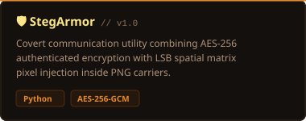
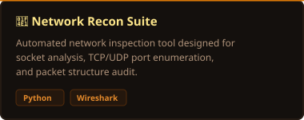

<!-- HEADER BANNER SVG -->

 

 
Profile Overview

I am a **Digital Forensics & Cybersecurity student (3rd Year)** specializing in network defense, security architecture, and applied cryptography. My goal is to build defense-in-depth utilities that merge low-level security concepts with accessible software implementations.

**Education:** B.S. in Digital Forensics & Cybersecurity — Hamdard University (2024–2028)
**Key Certs:** Microsoft Student SOC Foundations, Google Cybersecurity & Risk Management, Cisco Networking Basics
**Specializations:** Encrypted Steganography, Protocol Analysis, Threat Hunting, Vulnerability Auditing
**Environments:** Kali Linux, Windows Security Subsystems, Virtualization (VMware/VirtualBox)

---

###  Featured Projects

<table width="100%">
  <tr>
    <td width="50%" valign="top">
      
        
      
<b>Key Highlights:</b> Multi-layered covert communication utility combining AES-256-GCM authenticated encryption with LSB spatial matrix pixel injection inside PNG carriers.

    </td>
    <td width="50%" valign="top">
      
        
      
<b>Key Highlights:</b> Automated network inspection tool designed for socket analysis, TCP/UDP port enumeration, banner grabbing, and packet structure auditing.

    </td>
  </tr>
</table>

---

### Tech Stack & Security Toolkit

####  Security Tools & Forensics

  
  
  
  
  

* **Network Protocols:** TCP/IP, DNS, DHCP, VLAN Segmentation, PCAP Analysis
* **Cryptography & Steganography:** AES-256-GCM, PBKDF2-HMAC-SHA256, LSB Spatial Pixel Manipulation
* **Offensive & Defensive Security:** Ethical Hacking, Vulnerability Scanning, SOC Operations, Risk Management

####  Development & System Scripting

  
  
  
  

---

###  Certifications & Training

 **Microsoft:** Student SOC Program Foundations Training
 **Google:** Play It Safe: Manage Security Risks
 **Google:** Foundations of Cybersecurity
 **Cisco:** Networking Basics & Introduction to Cybersecurity

---

###  Roadmap & Focus Areas

<table width="100%">
  <tr>
    <td width="50%" valign="top">
      <h4><b> Current Focus</b></h4>
      <ul>
        <li>Applied Cryptography & Authenticated Encryption (AEAD)</li>
        <li>Digital Forensics Artifact Analysis & Memory Inspection</li>
        <li>Subnetting, Routing Architecture, and Network Hardening</li>
      </ul>
    </td>
    <td width="50%" valign="top">
      <h4><b> Future Directions</b></h4>
      <ul>
        <li>Advanced Penetration Testing & Vulnerability Assessment</li>
        <li>Web Application Security & OWASP Top 10 Auditing</li>
        <li>Automated Threat Intelligence Scripting in Python</li>
      </ul>
    </td>
  </tr>
</table>

---

  
 <b>Let's Connect:</b> <a href="https://www.linkedin.com/in/nabiha-majid-45234a272">LinkedIn Profile</a>

